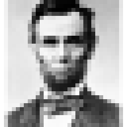

# Image generation with MATLAB

- Written by Yukiyasu Kamitani, April 16, 1999
- Modified by Mitsuaki Tsukamoto, November 15, 2016

Advantages of using MATLAB for image generation are:

- image as matrix: operation of images without "for" loop
- independent of platform
- mathematical transformation and analysis, combined with Image Processing Toolbox and Signal Processing Toolbox
- psychophysical experiment, combined with Psychophysics Toolbox (only for Mac)

Methods to generate 2D images as matrices using MATLAB are described here. 3D graphics is not covered.

## Basics of image generation with MATLAB (Image Processing Toolbox required)

### Basic image generation

White square (100x100 pix):

``` matlab
image = ones([100 100]);
imshow(image);

% By default, 0 -> black, 1 -> white.
```

Random-dot:

``` matlab
image = rand([100 100]);
imshow(image);
```

Sine grating:

``` matlab
image = 0.5 * sin([1:100]')*ones(1,100) + 0.5*ones([100 100]);
imshow(image);
```

Circle:

``` matlab
X = ones(100,1)*[-50:49]; Y = [-50:49]'*ones(1,100);
Z = X.^2 + Y.^2;
% mesh(Z);
image = zeros([100 100]);
image(find(Z <= 50^2)) = 1;
imshow(image);
```

### Index color

Assign color by defining a color map (256x3).

``` matlab
%index  [ R     G      B]       (R, G, B = 0 - 1)
%    1  [ 0     0      0]
%    2  [ 0.1   0      1]
%               :
%               :
%   256 [ 0     1     0.5]

image = ones([100 100]);    % square composed of index "1"s
colormap = [0:1/255:1]' * ones(1,3);   % black (1)- white(256)
colormap(1,:) = [1 0 0]; % index "1" -> red
imshow(image, colormap);
```

### Image analysis and processing (FFT and Convolution)



``` matlab
% Load jpeg files
orgImage = imread('Pixel.jpg', 'jpg');
figure(1); imshow(orgImage);

% 2D FFT
fftImage = fftshift(fft2(orgImage));   % 2d fft
ampImage= abs(fftImage);
figure(2); imshow(ampImage,  [0  10000 ]);

% Convolution (low-pass filtering)
filter = fspecial('gaussian',[10 10], 4);  % gaussian kernel
filterImage = conv2(orgImage, filter);     % convolution
figure(3); imshow(filterImage, [0 250]);

% 2D FFT of filtered image
fftFilterImage = fftshift(fft2(filterImage));
ampFilterImage= abs(fftFilterImage);
figure(4); imshow(ampFilterImage,  [0  10000 ]);
```

## Yuki Kamitani's image tools

This repository contains Matlab functions to generate pattern images and basic figures.
Here is a list of the functions and basic usage.

### pattern

Sine grating:

``` matlab
imageMatrix = sinGrating(vhSize, cyclesPer100Pix, orientation, phase, mean, amplitude)

% Example
imshow(sinGrating([100 100], 5, 45, 0, 0.5, 0.5));
```

Concentric sine pattern:

``` matlab
imageMatrix = sinConcentric(vhSize, cyclePer100pix, phase, mean, amplitude)

% Example
imshow(sinConcentric([100 100], 10, 0, 0.5, 0.5));
```

Gabor patch:

``` matlab
imageMatrix = gabor(vhSize, cyclesPer100Pix,orientation, phase, sigma , mean, amplitude)

% Example
imshow(gabor([100 100], 8, 45, 0, 6 , 0.5, 0.5));
```

Random dots:

``` matlab
imageMatrix = randDot(vhSize, dotSize, dotCol, backCol, density);

% Example
imshow(randDot([100 100], 5, 1, 0, 0.3));
```

### drawing

Filled oval:

``` matlab
imageMatrix = drawOvalFill(BaseIm, TopLeft_BotRight, foreground)

% Example
imshow(drawOvalFill(ones(150, 150), [50 50 90 90], 0.5));
```

Frame Oval:

``` matlab
imageMatrix = drawOvalFrame(BaseIm, TopLeft_BotRight, foreground, frameWidth)

% Example
imshow(drawOvalFrame(ones(150, 150), [50 50 90 90], 0.5, 3));
```

Filled Rectangle:

``` matlab
imageMatrix = drawRectFill(BaseIm, TopLeft_BotRight, foreground)

% Example
imshow(drawRectFill(zeros (100,100), [20 20 50 50], 1));
```

Frame rectangle:

``` matlab
imageMatrix = drawRectFrame(BaseIm, TopLeft_BotRight, foreground, frameWidth)

% Example
imshow(drawRectFrame(zeros (100,100), [20 20 50 50], 1,1));
```

Line:

``` matlab
imageMatrix = drawLines(BaseIm, startPos_endPos, foreground, PenSize)

% Example
imshow(drawLines(zeros(200,200), [100 100  180 140], 0.5, [2 2]));
```

Polygon:

``` matlab
imageMatrix = drawPolygon(BaseIm, dotPos, foreground)

%Example
imshow(drawPolygon(ones(100,100), [10 10 ; 90 30 ;  90 90], 0.5));
```

### tool

contains subfunctions used in the functions in 'pattern' and 'drawing'

### Examples

Neon color spreading:

``` matlab
radiusDisk = 35; % radius of disks
diskImage = drawOvalFill(zeros(200, 200), [50 50 50 50]+radiusDisk*[-1 -1 1 1], 1);
diskImage = drawOvalFill(diskImage, [150 50 150 50]+radiusDisk*[-1 -1 1 1], 1);
diskImage = drawOvalFill(diskImage, [50 150 50 150]+radiusDisk*[-1 -1 1 1], 1);
diskImage = drawOvalFill(diskImage, [150 150 150 150]+radiusDisk*[-1 -1 1 1], 1);

rectImage = drawRectFill(zeros(200,200), [40 40 160 160], 2);

neonImage = diskImage + rectImage + ones(200, 200);
% background: 1, pacman: 2, rectangle: 3, intersection: 4
colorMap = [0 0 0; 1 1 1; 0 0 0; 1 0 0];   % define color map for indices 1-4
imshow(neonImage, colorMap);

Random-dot stereogram

leftImage = randDot([200 200], 2, 1, 0, 0.5);
rightImage = leftImage;
smallRect =  randDot([70 70], 2, 1, 0, 0.5);  %square to be seen in depth

leftImage = imageOnImage(leftImage, smallRect, [100 100-10]);
rightImage = imageOnImage(rightImage, smallRect, [100 100+10]);

figure(1); imshow(leftImage);
figure(2); imshow(rightImage);
```

## Psychophysics Toolbox

Image matrices can be used for presenting visual stimuli with Psychophysics Toolbox. Instead of imshow (imageMatrix):

``` matlab
SCREEN(windowPointer,'PutImage',imageMatrix);
```

Color map can be defined by:

``` matlab
SCREEN(windowPointer,'SetClut', colorMap);
```

Color values in color map of Psychophysics Toolbox are 0-255, not 0-1.

[Psychophysics Toolbox Home](http://psychtoolbox.org/download/)
